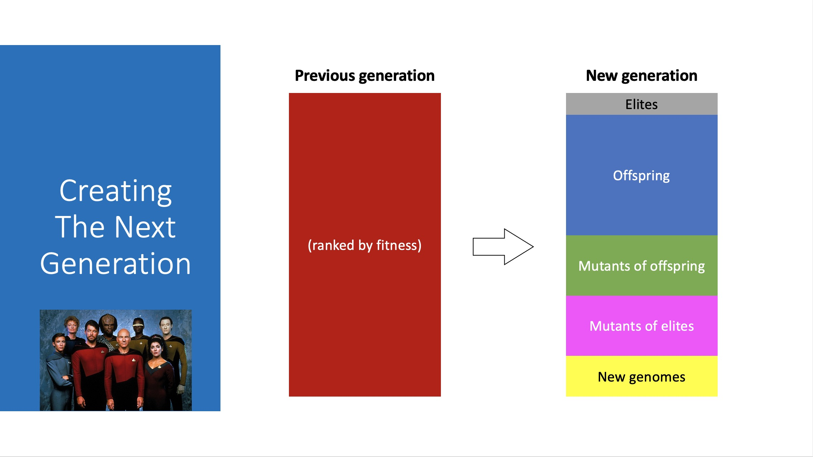

# Machine learning cars


https://medium.com/@j.c.ransome/what-is-a-neural-network-and-how-can-i-teach-it-to-race-a-car-machine-learning-in-unity-3d-94c199a9e440


## What is this? 

A project I created to learn about machine learning. Artificial neural networks are given control of cars and 'learn' to drive them around a track. Learning is accomplished via a genetic algorithm that takes the best performing cars (the ones that make it the furthest around the track) and creates successive 'generations' that are based on them through mutation and/or genetic crossover, iterating towards better performing cars.

❕Features include❕
- easy creation of 'species' via scriptable objects (with configurable network structure, sensor arrays, fitness rewards, evolution hyperparameters)
- parallel species evolution
- saving of historical fitness data in CSVs 
- saving of the current generation's neural networks in json for loading later
- use of different activation functions in the same neural network
- tests!




## Installation

This project runs with Unity (2021.1.1f1) and requires Fluent Assertions (for tests). To install the latter via the Unity editor go to:

``` 
Window -> Package Manager -> + sign -> Add via git url:

https://github.com/BoundfoxStudios/fluentassertions-unity.git#upm 
```

Open the **Cars** scene and hit play to create a new seed generation and watch them evolve. Generation 'progress' can be saved from the game view ui by entering a name in the text input and clicking save. Saved generations will appear on the right and can be loaded by clicking on them.


## Things to add/do
- Q learning
- NEAT algorithm
- visualise fitness of generations over time
- visualise the network itself
- add new tracks
- apply to some other problem/challenge
- experiment with changing the fitness function
